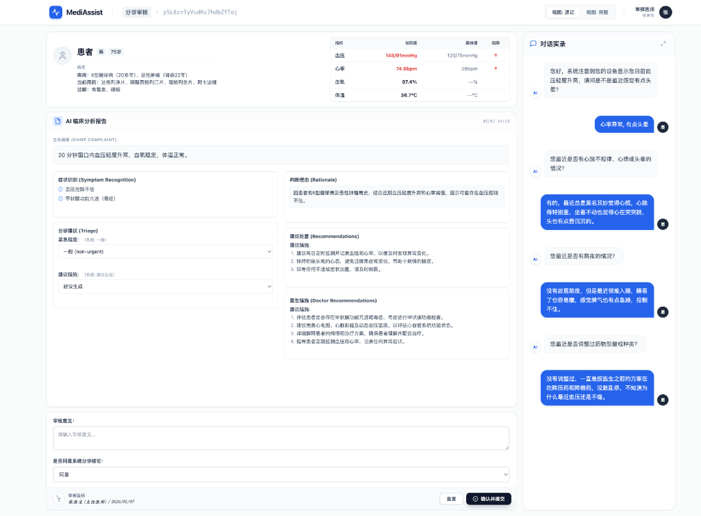
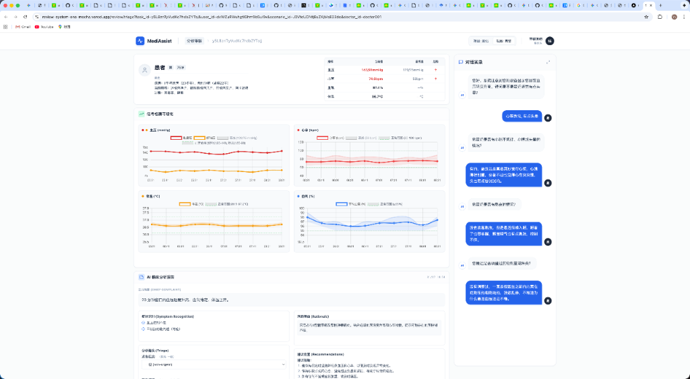

# MediAssist 分诊审核系统

医生对 AI 分诊结果进行复核与批注的初步工具。

## 📸 界面预览

### 简洁视图


### 完整视图（含信号数据）


## ✨ 核心功能

| 功能 | 说明 |
|------|------|
| **AI 分诊结果展示** | 显示症状识别、紧急程度、可能病因、建议操作 |
| **患者基本信息** | 生命体征（血压、心率、血氧、体温）、病史、用药情况 |
| **对话记录** | 查看 AI 与患者的问诊对话 |
| **信号数据可视化** | 血压、心率、体温、血氧的趋势图（完整视图） |
| **复核决策** | 医生审核 AI 判断，选择同意或提出修改意见 |
| **批注功能** | 医生添加审核意见和补充说明 |

## 🩺 医生分配模块

系统实现了基于 **负载均衡** 的任务分配策略：

- 获取所有医生及其当前未审核任务数量
- 优先分配给任务数量最少的医生
- 支持按医院筛选医生

```python
from task_assignment import TaskAssigner

assigner = TaskAssigner(strategy="load_balance")
result = assigner.assign_task(user_id="...", scenario_id="...", task_id="...")
# result.doctor_id → 分配的医生ID
# result.assignment_reason → 分配理由
```

## 🔌 API 接口

### 创建审核任务

外部系统调用此接口创建审核任务。

```
POST /openapi/review/task/create
```

**请求参数 (JSON)**
```json
{
  "user_id": "用户ID",
  "scenario_id": "场景ID"
}
```

**返回示例**
```json
{
  "success": true,
  "task_id": "自动生成的任务ID",
  "review_url": "审核页面URL",
  "doctor_id": "分配的医生ID"
}
```

---

### 获取分诊数据

```
GET /api/diagnosis-system/triage-view/by-task?task_id=xxx&user_id=xxx&scenario_id=xxx
```

---

### 提交审核结果

```
POST /api/diagnosis-system/triage-review/submit
```

**请求参数 (JSON)**
```json
{
  "task_id": "任务ID",
  "user_id": "用户ID",
  "scenario_id": "场景ID",
  "decision": {
    "approved": true,
    "reviewer_id": "医生ID"
  },
  "modifications": []
}
```

## 🚀 部署

本项目已部署在 Vercel：

[](https://vercel.com/new/clone?repository-url=https://github.com/860844175/review_system)

## 💻 本地开发

### 安装依赖

```bash
pip install -r requirements.txt
```

### 启动服务

```bash
python simple_server.py
```

服务将在 `http://localhost:5001` 启动。

### 访问审核页面

```
http://localhost:5001/review/triage?task_id=xxx&user_id=xxx&scenario_id=xxx
```

## 📁 项目结构

```
review-system-core/
├── api/                    # Vercel API 入口
├── adapters/               # 数据适配器
├── clients/                # 外部服务客户端
├── config/                 # 配置文件
├── frontend/               # 前端页面
├── services/               # 服务层
├── task_assignment/        # 任务分配模块
├── simple_server.py        # 主服务文件
└── vercel.json             # Vercel 配置
```

## 🔧 环境变量

| 变量名 | 说明 |
|--------|------|
| `DIAGNOSIS_SYSTEM_BASE_URL` | 诊断系统 API 地址 |
| `DIAGNOSIS_SYSTEM_API_KEY` | 诊断系统 API Key |
| `APPROVAL_PLATFORM_BASE_URL` | 审核平台地址 |
| `APPROVAL_PLATFORM_API_KEY` | 审核平台 API Key |

## 📄 License

MIT
